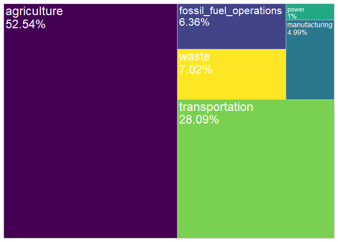

<!-- README.md is generated from README.Rmd. Please edit that file -->

# Caracterização dos municípios paulistas para intervenção ambiental na redução de emissões de gases de efeito estufa

**Tema do projeto:** Mudanças Climáticas Globais

**Local de desenvolvimento da intervenção:** Estudo realizado na FCAV-
UNESP, com foco para os municípios do Estado de São Paulo, Brasil.

**Objetivos do projeto, incluindo as mudanças a serem atingidas:** O
projeto tem como principal objetivo fornecer subsídios para a tomada de
decisão em políticas públicas, com foco na redução do desmatamento, na
promoção de práticas sustentáveis na agricultura e uso da terra, na
conservação dos biomas brasileiros e no desenvolvimento de tecnologias
para monitoramento e mitigação de emissões, especialmente nos municípios
do estado de São Paulo. Para isso, serão adotadas técnicas de
inteligência artificial, como aprendizado de máquina, para análise de
dados do Climate TRACE, identificando padrões e agrupando municípios
para definir as variáveis mais relevantes em cada um, proporcionando
subsídios estratégicos para as ações de intervenção.

**Resumo** A elevação da temperatura global destaca a importância dos
países atingirem o equilíbrio líquido de zero emissões de gases de
efeito estufa (GEE) até meados deste século. Para isso, é importante
equilibrar as fontes e sumidouros de emissões; nesse contexto, em 2015,
o Brasil apresentou suas metas de redução de emissões em suas primeiras
Contribuições Nacionalmente Determinadas (NDC) para a Convenção das
Nações Unidas sobre Mudança do Clima (UNFCCC). As estimativas do balanço
de carbono podem ser feitas com vários métodos, desde amostragem de
gases atmosféricos, técnicas de torres estáticas e métodos de
inventários usando fatores de emissão em diretrizes com protocolos do
IPCC (Painel Intergovernamental sobre Mudança do Clima). Recentemente, o
Climate TRACE, uma coalizão de organizações que trabalham para melhorar
o monitoramento de emissões, desenvolveu uma abordagem que combina
sensoriamento remoto, técnicas de aprendizado de máquina e dados de
inventários para estimar as emissões globais de gases de efeito estufa
por setor (www.climatetrace.org). Os dados do Climate TRACE incluem
estimativas de emissões para Agricultura, Edifícios, Operações de
Combustíveis Fósseis, Floresta e Uso da Terra, Gases Fluorados,
Manufatura, Extração Mineral, Energia e Resíduos. No contexto deste
projeto, serão aplicadas técnicas de inteligência artificial, como
aprendizado de máquina estatístico, para identificar padrões e agrupar
os municípios do estado de São Paulo em fontes e sumidouros de gases,
isso permitirá a definição das variáveis chaves para descrever as
emissões e fornecer os subsídios necessários para a criação de
estratégias de intervenção locais.

## Carregando os pacotes

``` r
library(tidyverse)
```

## Entrada dos dados

``` r
list_rds <- list.files("data/")
dados <- map_df(
  list_rds,
  ~read_rds(paste0("data/",.x))
)
brazil_ids <- read_rds("data-raw/df_nome.rds")
nomes_uf <- c(brazil_ids$nome_uf %>% unique(),"Brazil")
abbrev_states <- brazil_ids$sigla_uf %>% unique()
```

## Municipios `geobr`

``` r
city <- geobr::read_municipality(
  showProgress = FALSE)
```

## Definindo os municípios do estado de São Paulo

``` r
sp_city <- city %>%  
  filter(abbrev_state == "SP")
```

## Estado de São Paulo

``` r
sp_city %>%  
  ggplot()  +
  geom_sf(fill="white", color="black",
          size=.15, show.legend = FALSE) +
  geom_point(
    data = dados %>%
      filter(year == 2022
             ),
    aes(lon,lat, color = biome))
```

<!-- -->

``` r
dados %>% 
  filter(created_date < as.Date("2024-01-01"),
         year == 2022,
         gas == "co2e_100yr",
         !source_name %in% nomes_uf,
         !sub_sector %in% c("forest-land-clearing",
                            "forest-land-degradation",
                            "shrubgrass-fires",
                            "forest-land-fires",
                            "wetland-fires",
                            "removals"),
         sector_name != "forestry_and_land_use",
         #sub_sector == "international-aviation"
         city_ref == "Barretos"
         ) %>% 
  group_by(source_name) %>% 
  summarise(
    emission = sum(emissions_quantity, na.rm=TRUE)
  ) %>% 
  arrange(desc(emission))  %>% 
  ungroup() %>% 
  mutate(emisison_acumulada = cumsum(emission))
#> # A tibble: 13 × 3
#>    source_name                                  emission emisison_acumulada
#>    <chr>                                           <dbl>              <dbl>
#>  1 Barretos                                     707278.             707278.
#>  2 Barretos Urban Area in Barretos Municipality 149011.             856289.
#>  3 BRA_beef_236                                  26749.             883038.
#>  4 BRA_beef_235                                   8658.             891695.
#>  5 BRA_beef_237                                   5553.             897249.
#>  6 ETE 3   BURACAO                                4004.             901253.
#>  7 BRA_beef_238                                   3220.             904472.
#>  8 ETE 1   BARRETOS 2                             1560.             906033.
#>  9 ETE 2   DAMA                                    919.             906951.
#> 10 ETE 4   ESTRADA DA VENDINHA                     919.             907870.
#> 11 ETE   5 DISTRITO INDUSTRIAL                     325.             908195.
#> 12 ETE   6 ALBERTO MOREIRA                          45.5            908241.
#> 13 Chafei Amsei Airport                              0              908241.
```

``` r
library(treemapify)
dados %>% 
  filter(created_date < as.Date("2024-01-01"),
         year == 2022,
         gas == "co2e_100yr",
         !source_name %in% nomes_uf,
         !sub_sector %in% c("forest-land-clearing",
                            "forest-land-degradation",
                            "shrubgrass-fires",
                            "forest-land-fires",
                            "wetland-fires",
                            "removals"),
         sector_name != "forestry_and_land_use",
         #sub_sector == "international-aviation"
         #source_name == "Guarulhos - Governador André Franco Montoro International Airport"
         )  %>% 
  group_by(sector_name) %>% 
  summarise(
    emission = sum(emissions_quantity, na.rm=TRUE)
  ) %>% 
  arrange(emission)  %>% 
  ungroup() %>% 
  mutate(emisison_p = emission/sum(emission)*100) %>% 
  ggplot(aes(area = emisison_p, fill = sector_name)) +
  geom_treemap() +
  geom_treemap_text(
    aes(label = paste(sector_name, 
                      paste0(round(emisison_p, 2), "%"), sep = "\n")), 
    colour = "white") +
  theme(legend.position = "none") +
  scale_fill_viridis_d()
```

<!-- -->

``` r
dd <- dados %>% 
  filter(created_date < as.Date("2024-01-01"),
         year == 2022,
         gas == "co2e_100yr",
         !source_name %in% nomes_uf,
         !sub_sector %in% c("forest-land-clearing",
                            "forest-land-degradation",
                            "shrubgrass-fires",
                            "forest-land-fires",
                            "wetland-fires",
                            "removals")
         )  %>% 
  group_by(city_ref) %>% 
  summarise(
    emission = sum(emissions_quantity, na.rm=TRUE)
  )

sp_city %>% 
  inner_join( dd %>% 
    rename(name_muni = city_ref),
    by="name_muni"
  ) %>% 
  mutate(class_emission = if_else(emission<0,"sink","source") ) %>% 
  ggplot() +
  geom_sf(aes(fill=class_emission), color="black",
          size=.15, show.legend = TRUE)  +
  scale_fill_manual(values = c("lightblue","red")) +
    labs(title = "Balanço em 2022") +
  geom_point(
    data = dados %>%
      filter(year == 2022
             ),
    aes(lon,lat, color = biome))
```

<!-- -->

``` r
cores <- c("#00A087FF", "#4DBBD5FF", "#E64B35FF", "#3C5488FF",
           "#F39B7FFF", "#8491B4FF",
           "#91D1C2FF", "#DC0000FF", "#7E6148FF", "#B09C85FF")

max_sector_find <- function(df){
  sn <- df %>% pull(sector_name)
  em <- df %>% pull(emission)
  re <- sn[which.max(em)]
  return(re)
}

d <- dados %>% 
  filter(created_date < as.Date("2024-01-01"),
         year == 2022,
         gas == "co2e_100yr",
         !source_name %in% nomes_uf,
         !sub_sector %in% c("forest-land-clearing",
                            "forest-land-degradation",
                            "shrubgrass-fires",
                            "forest-land-fires",
                            "wetland-fires",
                            "removals"),
         #emissions_quantity > 0
         ) %>% 
  group_by(city_ref,sector_name) %>% 
  summarise(
    emission = sum(emissions_quantity, na.rm=TRUE)
  ) %>% 
  nest() %>% 
  mutate(
    max_sector = map(data,max_sector_find)
  ) %>% 
  select(city_ref, max_sector) %>% 
  ungroup() %>% 
  unnest()

sp_city %>% 
  inner_join( d %>% 
    rename(name_muni = city_ref),
    by="name_muni"
  ) %>% 
  ggplot() +
  geom_sf(aes(fill=max_sector), color="black",
          size=.15, show.legend = TRUE)  +
  scale_fill_manual(values = cores[-(6:8)]) +
    labs(title = "Maiores setores emissores em 2022") 
```

<!-- -->

``` r
min_sector_find <- function(df){
  sn <- df %>% pull(sector_name)
  em <- df %>% pull(emission)
  re <- sn[which.min(em)]
  return(re)
}

ddd <- dados %>% 
  filter(created_date < as.Date("2024-01-01"),
         year == 2022,
         gas == "co2e_100yr",
         !source_name %in% nomes_uf,
         !sub_sector %in% c("forest-land-clearing",
                            "forest-land-degradation",
                            "shrubgrass-fires",
                            "forest-land-fires",
                            "wetland-fires",
                            "removals"),
         #emissions_quantity < 0
         ) %>% 
  group_by(city_ref,sector_name) %>% 
  summarise(
    emission = sum(emissions_quantity, na.rm=TRUE)
  ) %>% 
  nest() %>% 
  mutate(
    min_sector = map(data,min_sector_find)
  ) %>% 
  select(city_ref, min_sector) %>% 
  ungroup() %>% 
  unnest()

sp_city %>% 
  inner_join( ddd %>% 
    rename(name_muni = city_ref),
    by="name_muni"
  ) %>% 
  ggplot() +
  geom_sf(aes(fill=min_sector), color="black",
          size=.15, show.legend = TRUE)  +
  scale_fill_manual(values = cores[c(1,2,5,10)]) +
    labs(title = "Menores setores emissores em 2022") 
```

<!-- -->

``` r
dados %>% 
  filter(created_date < as.Date("2024-01-01"),
         year == 2022,
         gas == "co2e_100yr",
         !source_name %in% nomes_uf,
         !sub_sector %in% c("forest-land-clearing",
                            "forest-land-degradation",
                            "shrubgrass-fires",
                            "forest-land-fires",
                            "wetland-fires",
                            "removals"),
         sector_name != "forestry_and_land_use"
         ) %>% 
  group_by(city_ref,sector_name) %>% 
  summarise(
    emission = sum(emissions_quantity, na.rm=TRUE)
  )  %>% 
  group_by(city_ref) %>% 
  mutate(
    n_emission = sum(emission, na.rm=TRUE),
  )  %>% 
  ungroup() %>% 
  mutate(city_ref = city_ref %>% 
           fct_lump(n=30,w=n_emission) %>% 
           fct_reorder(n_emission)) %>% 
  filter(city_ref != "Other") %>% 
  ggplot(aes(x=city_ref, y=emission, fill=sector_name)) +
  geom_col(color="black") +
  coord_flip() +
  theme_bw()
```

<!-- -->
